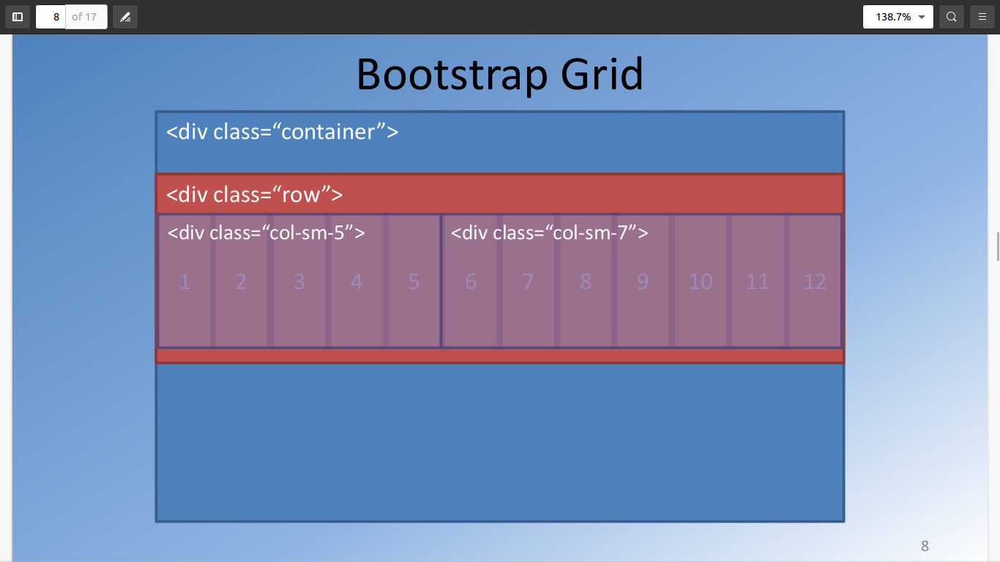
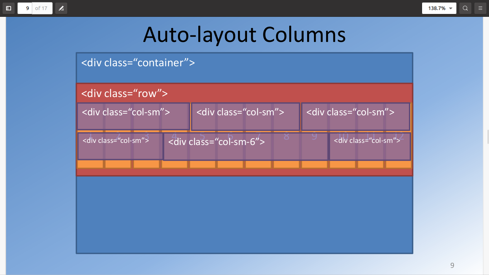
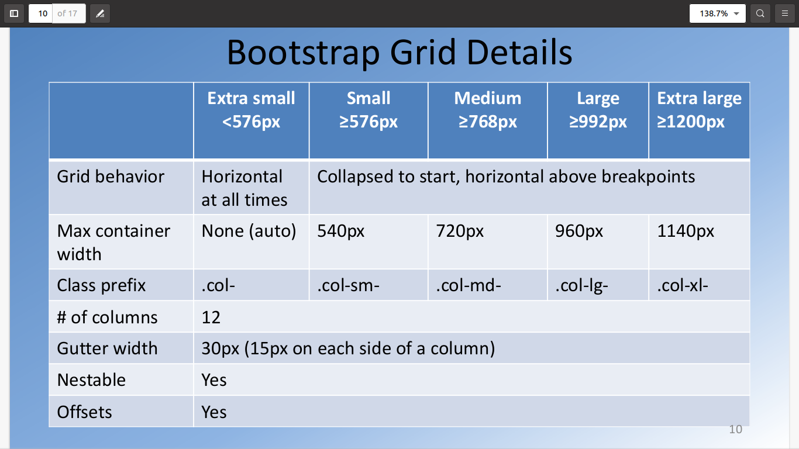
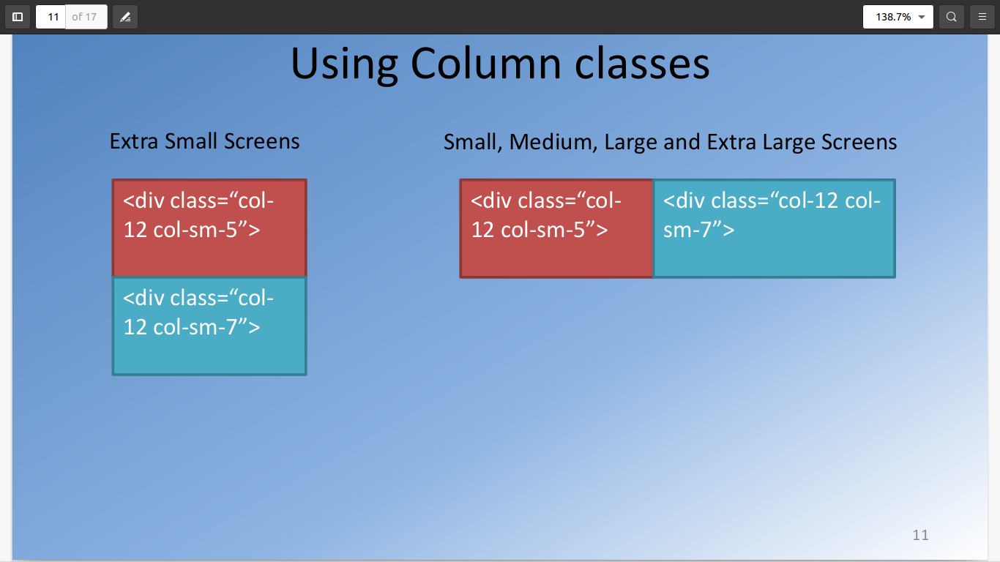
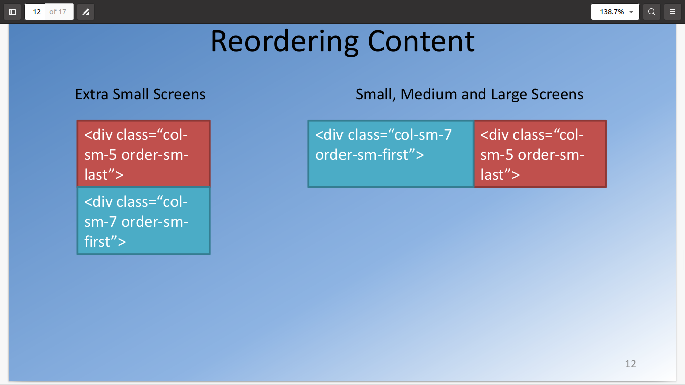
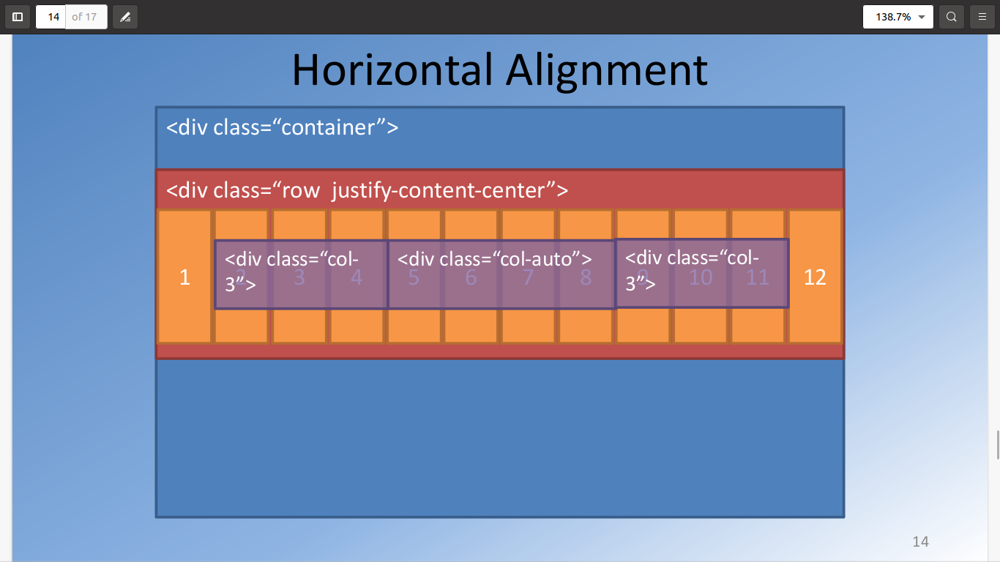
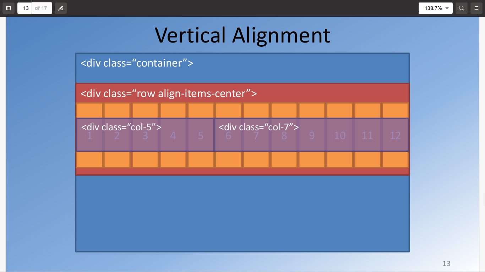
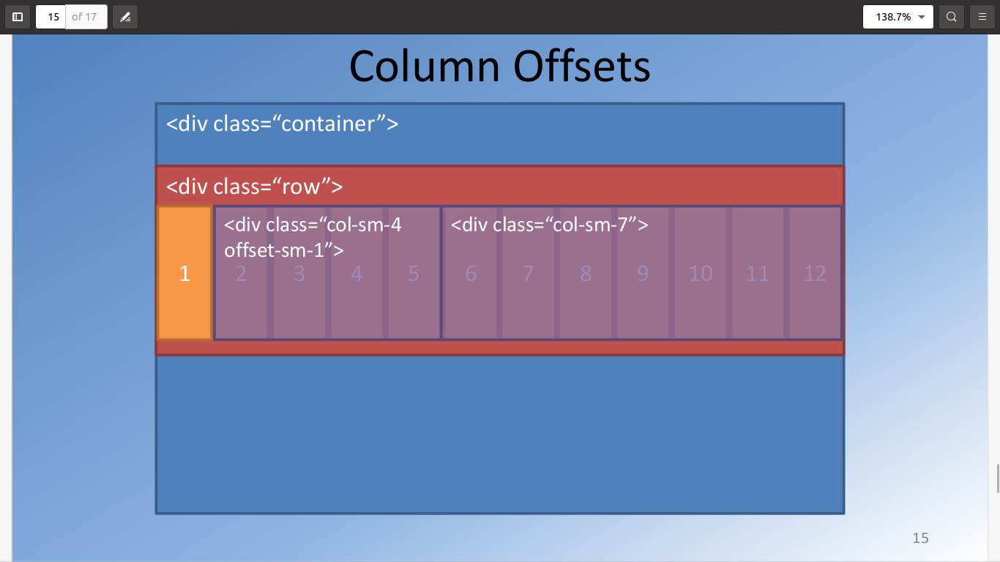
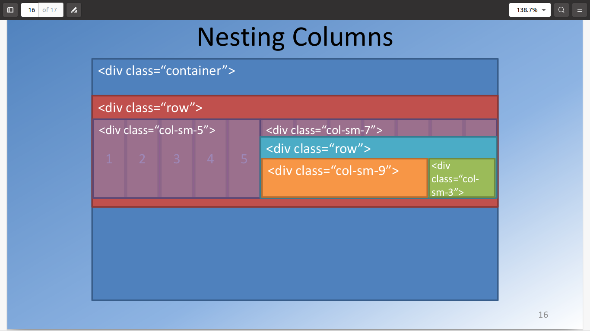

# bootstrap
## Bootstrap GridSystem
In bootstrap grid system, if we use a container class then its width is arranged according to the screen sizes. Inside the container class we
use a row class and each row class corresponds to the 12 columns. There are five coloumns class in bootstrap.
- Extra small
- Small
- middium
- Large
- Extra Large
By default, the content in row is rendered from extra small to extra large and occupy complete 12 columns if we are not specify the column class.
###  Specific-Layout Columns:
When we specify the column class, for example class="col-sm-5" then the content in five columns will occupy for small, medium, large, extra large
screens and for extra small the content occupy the entire screens.
 
## Auto-Layout Columns:
Bootstrap Provide us the auto-layout columns. It means when we are using three div's inside a row class="col-sm" and we are not specify the column
size the bootstrap automatically adjust the columns sizes into 12 means (12/3=3) each column occupy three columns space.   
 
## Detailed Grid System:

### Effects of columns:

When we set a column class size  its size effect on further classes in an order.

### Reordering the content:

We can reorder our content displaying in the columns of our bootstrap grid. The content in first place can be replaced to second postion.

### Horizantal Align:
We can horizantly align our content in a row of bootstrap grid system by using <b>class="justify-content-<u>center</u>"</b> This can be left
,right and etc. see bootstrap documentation.

###  Vertical Align:

We can also vertically align the items in grid system colums of bootstrap by using <b>class = "align-items-<u>center</u>"</b> This can be left
,right and etc. see bootstrap documentation.

### Column Offset:

We can use column offset to display the content of out webpage in our layout. For this we use a class off-sm-1or2orwhatever you want. In this
way, the content shifted towards right.

### Nested Columns:
We can use another row inside a column like this

